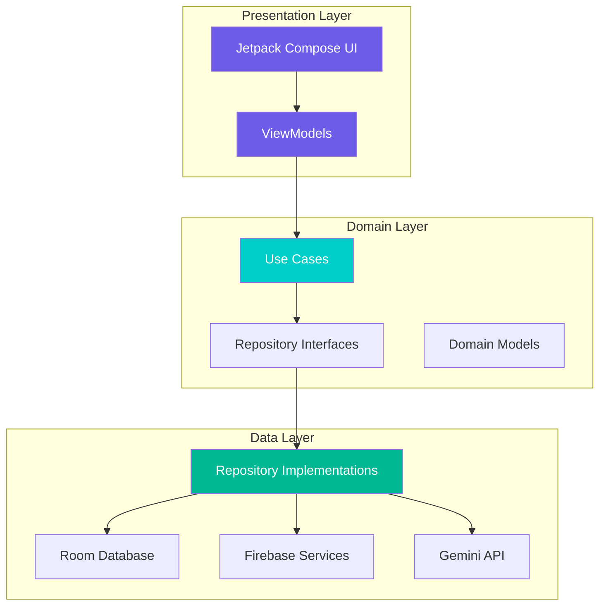
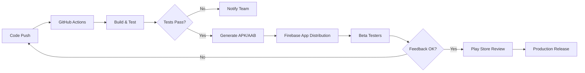

# HustleHub - Product Requirements Document (PRD)

<div align="center">


**Your Campus Marketplace**


[](https://developer.android.com)
[](LICENSE)

*Connecting campus hustlers with customers through trust, convenience, and innovation*

</div>

---

## 📋 Table of Contents

- [1. Executive Summary](#1-executive-summary)
- [2. Product Overview](#2-product-overview)
- [3. Features & Requirements](#3-features--requirements)
- [4. Technical Architecture](#4-technical-architecture)
- [5. UI/UX Requirements](#5-uiux-requirements)
- [6. Development Plan](#6-development-plan)
- [7. Testing & Deployment](#7-testing--deployment)
- [8. Risks & Mitigation](#8-risks--mitigation)
- [9. Success Metrics](#9-success-metrics)
- [10. Team & Resources](#10-team--resources)

---

## 1. Executive Summary

### 🎯 Vision
Transform the informal peer-to-peer service economy at Meru University into a structured, trustworthy, and engaging marketplace where students can discover services, build reputations, and connect safely.

### 🔍 The Problem
Students at Meru University offer diverse services—**laundry, salon, tutoring, graphic design, photography, food, tailoring**, and more. Today, this vibrant economy operates entirely through:
- **WhatsApp groups**: Chaotic, unsearchable, messages get buried
- **Word of mouth**: Limits provider reach to small circles
- **No trust layer**: Customers can't assess quality before committing
- **Privacy risks**: Students must share personal phone numbers
- **No organization**: Past transactions and conversations are lost

### 💡 The Solution
**HustleHub** is a native Android application that organizes this economy through:

| Feature | Benefit |
|---------|---------|
| 🔍 **AI-Powered Search** | "braids near Gate B under 500" → instant matches |
| 💬 **In-App Messaging** | Chat without sharing phone numbers |
| 🗺️ **Campus Map** | See available providers in real-time |
| ⭐ **Reputation System** | Ratings, reviews, and Hustle Score |
| 🎓 **Student-Only Access** | Verified via @must.ac.ke email |
| 📸 **Service Portfolios** | Showcase work with before/after images |

### 🎪 Core Principle
**Connect, don't control.** Providers set their own prices, schedules, and terms. We handle discovery, communication, and trust.

---

## 2. Product Overview

### 2.1 Problem Statement

| Problem | Impact | HustleHub Solution |
|---------|--------|-------------------|
| Services shared via WhatsApp groups | Impossible to search, messages buried | Categorized discovery feed + AI search |
| Word of mouth only | Limited provider reach | Campus-wide visibility for all providers |
| No reputation system | Cannot assess quality or reliability | Ratings, reviews, and Hustle Score |
| No dedicated platform | General marketplaces ignore campus niche | Campus-specific features (map, student verification) |
| Privacy risk | Must share personal phone numbers | In-app messaging, no number sharing required |
| No organization | Lost transactions & conversations | Persistent chat history, profile portfolios |

### 2.2 Target Users

#### 👨‍💼 Primary: Service Providers
**Students offering services** (laundry, salon, tutoring, design, food, etc.)

- **Demographics**: Age 18–26, tech-savvy smartphone users
- **Characteristics**: Budget-conscious, entrepreneurial mindset
- **Motivations**: 
  - Earn income while studying
  - Build a client base on campus
  - Gain visibility beyond immediate friends
  - Establish reputation for future opportunities

#### 👥 Primary: Service Customers
**Students seeking affordable, convenient services from peers**

- **Demographics**: Age 18–26, mobile-first generation
- **Characteristics**: Value trust and convenience
- **Motivations**: 
  - Find reliable providers quickly
  - Avoid scams and low-quality services
  - Access affordable campus-specific services
  - Support fellow students

#### 🏛️ Secondary: Campus Administration
**University officials interested in student welfare**

- **Use Case**: Aggregate data for entrepreneurship programs
- **Privacy**: Only anonymized, aggregate statistics shared

### 2.3 Value Proposition

#### For Providers:
✅ **Professional presence** without website costs  
✅ **Campus-wide discovery** beyond friend circles  
✅ **Build trust** through ratings and reviews  
✅ **Safe communication** without sharing personal contact  
✅ **Portfolio showcase** to attract quality clients  

#### For Customers:
✅ **Easy discovery** of services they need  
✅ **Quality assurance** through ratings and reviews  
✅ **Safe transactions** with verified students only  
✅ **Convenient communication** all in one app  
✅ **Location-based search** to find nearby providers  

---

## 3. Features & Requirements

### 3.1 MVP Features (v1.0 - 3 Months)

#### 🔐 Authentication & Verification
- [x] **Student email signup** (@must.ac.ke domain)
- [x] **Email OTP verification** (6-digit code)
- [x] **Google Sign-In** (restricted to @must.ac.ke)
- [x] **Profile creation**: name, photo, course, year, residence
- [x] **Role selection**: Provider / Customer / Both

**User Story**: *"As a student, I want to sign up with my university email so that only verified students can access the platform."*

---

#### 📋 Service Profiles
- [x] **Create/edit service listings**
  - Title, category, description
  - Price range (min-max)
  - Tags for discoverability
- [x] **Portfolio upload** (multiple images, before/after)
- [x] **Availability toggle**: Available / Busy / Offline
- [x] **Service categories**:
  - 💇 Salon & Beauty
  - 🧺 Laundry
  - 📚 Tutoring
  - 🍔 Food & Catering
  - 💻 Tech Services
  - 👗 Fashion & Tailoring
  - 📷 Photography & Videography
  - 🎨 Graphic Design
  - 🔧 Other Services

**User Story**: *"As a provider, I want to create a service listing with photos and pricing so customers can find me."*

---

#### 🔍 Discovery Feed
- [x] **Browse by category** with horizontal chips
- [x] **Text search** with instant results
- [x] **AI-powered natural language search**
  - Example: *"braids near Gate B under 500"*
  - Gemini API integration
  - Match scoring and relevance ranking
- [x] **Filters**:
  - Category
  - Rating (1-5 stars)
  - Availability status
  - Distance from user
  - Price range
- [x] **Sort options**:
  - Relevance (AI match score)
  - Highest rated
  - Newest first
  - Nearest location

**User Story**: *"As a customer, I want to search using natural language so I can find the best match quickly."*

---

#### 💬 Messaging System
- [x] **1-on-1 real-time chat**
  - Text messages
  - Timestamps
  - Message status (sent, delivered, read)
- [x] **Voice notes**
  - Record and send (max 2 minutes)
  - Playback with waveform visualization
  - Pause/resume functionality
- [x] **Image sharing**
  - Gallery picker
  - Camera capture
  - Image preview and fullscreen view
- [x] **Service Request Cards**
  - Auto-generated from service listing
  - Quick booking from discovery
- [x] **Location sharing**
  - One-tap to share current location
  - Map preview in chat
- [x] **Quick replies** (for providers)
  - "Available now"
  - "Coming soon"
  - "Busy, try later"
  - Custom templates
- [x] **Presence indicators**
  - Online/offline status
  - Typing indicators
  - Read receipts
- [x] **Unread badges** on chat list

**User Story**: *"As a user, I want to send voice notes so I can communicate faster than typing."*

---

#### 🗺️ Campus Map
- [x] **Google Maps integration**
  - Focus on Meru University campus area
  - Custom map styling
- [x] **Provider location pins**
  - Color-coded by category
  - Clustered markers for performance
  - Custom icons per service type
- [x] **User location** (blue dot)
- [x] **Filter pins by category**
- [x] **Tap pin → bottom sheet preview**
  - Provider name and photo
  - Service title
  - Rating and availability
  - Distance from user
  - Quick actions: View Profile | Chat
- [x] **Distance calculation** and display

**User Story**: *"As a customer, I want to see available providers on a map so I can find someone nearby."*

---

#### ⭐ Ratings & Reviews
- [x] **Rate provider after service**
  - 1-5 star rating
  - Optional written comment
  - Anonymous or named (user choice)
- [x] **Auto-prompt in chat** after service completion
- [x] **Review display on profile**
  - Most recent reviews shown first
  - Overall rating badge
  - Total review count
- [x] **Average rating calculation**
  - Updates in real-time
  - Weighted by recency (newer = higher weight)
- [x] **Review moderation**
  - Report inappropriate reviews
  - Admin review flagging

**User Story**: *"As a customer, I want to rate and review a provider after service so others can benefit from my experience."*

---

#### 🔔 Notifications
- [x] **Push notifications via FCM**
  - New message notifications
  - New review notifications
  - Service inquiry alerts
- [x] **In-app notification center**
  - Activity feed
  - Mark as read
  - Notification history
- [x] **Deep linking**
  - Tap notification → navigate to relevant screen
- [x] **Notification preferences**
  - Toggle notification types
  - Quiet hours
  - Sound and vibration settings

**User Story**: *"As a provider, I want to receive notifications when someone contacts me so I don't miss opportunities."*

---

### 3.2 Future Features (Post-MVP)

| Feature | Phase | Description | Priority |
|---------|-------|-------------|----------|
| 📞 **Voice/Video Calls** | Phase 2 | WebRTC peer-to-peer calling in-app | High |
| 💰 **M-Pesa Integration** | Phase 2 | Send/request payments directly in chat | High |
| 🏆 **Hustle Score & Badges** | Phase 2 | Gamified reputation: Top Rated, Fast Responder, etc. | Medium |
| 📊 **Leaderboards** | Phase 2 | Weekly/monthly top providers per category | Medium |
| 🔄 **Service Swap (Barter)** | Phase 3 | Match providers willing to trade services | Low |
| 🚨 **Emergency Requests** | Phase 3 | Broadcast urgent needs to nearby providers | Medium |
| 🏫 **Multi-Campus Support** | Phase 3 | Expand to Kenyatta, UoN, etc. | High |
| 📈 **Provider Analytics** | Phase 3 | Dashboard: views, bookings, ratings trends | Medium |
| 🌐 **Admin Panel (Web)** | Phase 4 | Content moderation, user management | High |
| 🎓 **Skill Verification** | Phase 4 | Verify tutors, designers with credentials | Low |

---

### 3.3 User Stories by Role

#### Authentication
```gherkin
Feature: User Authentication

  Scenario: Student signs up with university email
    Given I am a new user
    When I enter my @must.ac.ke email and create a password
    Then I receive an OTP verification code
    And after verification, I can set up my profile

  Scenario: Student logs in with Google
    Given I have a @must.ac.ke Google account
    When I tap "Sign in with Google"
    Then I am authenticated and redirected to the home screen
```

#### Service Provider
```gherkin
Feature: Service Management

  Scenario: Provider creates a new service listing
    Given I am logged in as a provider
    When I navigate to "Create Service"
    And I fill in title, category, description, and price
    And I upload portfolio images
    Then my service is published and visible in the feed

  Scenario: Provider toggles availability
    Given I have an active service listing
    When I toggle my status to "Busy"
    Then customers see I am currently unavailable
    And I stop receiving new inquiries
```

#### Service Customer
```gherkin
Feature: Service Discovery

  Scenario: Customer searches with natural language
    Given I am on the home screen
    When I search for "braids near Gate B under 500"
    Then I see AI-matched results ranked by relevance
    And each result shows distance, price, and rating

  Scenario: Customer views provider profile
    Given I found a service I'm interested in
    When I tap the service card
    Then I see the provider's full profile with portfolio
    And I can read reviews from other customers
    And I can initiate a chat
```

#### Messaging
```gherkin
Feature: In-App Communication

  Scenario: Customer sends a voice note
    Given I am in a chat with a provider
    When I press and hold the microphone button
    And I record my message
    Then the voice note is sent to the provider
    And they can play it immediately

  Scenario: Provider shares location
    Given I am chatting with a customer
    When I tap the location sharing button
    Then my current campus location is sent
    And the customer sees a map with my pin
```

---

## 4. Technical Architecture

### 4.1 Tech Stack

#### 📱 Frontend (Android)
| Layer | Technology | Purpose |
|-------|------------|---------|
| **Language** | Kotlin 1.9+ | Primary development language |
| **UI Framework** | Jetpack Compose | Declarative, modern UI toolkit |
| **Architecture** | MVVM + Clean Architecture | Separation of concerns, testability |
| **Navigation** | Compose Navigation | Type-safe, single-activity architecture |
| **Dependency Injection** | Hilt (Dagger) | Compile-time DI with Kotlin support |
| **Networking** | Retrofit 2 + OkHttp 4 | REST API client with interceptors |
| **Local Database** | Room 2.6+ | Offline caching, message persistence |
| **Image Loading** | Coil 2.x | Compose-native, coroutine-based |
| **State Management** | Kotlin Flow + StateFlow | Reactive, lifecycle-aware streams |

#### ☁️ Backend (Firebase)
| Service | Purpose |
|---------|---------|
| **Firebase Auth** | Email/password + Google sign-in |
| **Firestore** | NoSQL database for users, services, reviews |
| **Realtime Database** | Low-latency chat messages and presence |
| **Firebase Storage** | Profile photos, portfolios, voice notes |
| **Cloud Messaging (FCM)** | Push notifications |
| **Cloud Functions** | Server-side logic (rating aggregation, moderation) |
| **Crashlytics** | Crash reporting and analytics |
| **Performance Monitoring** | App performance tracking |

#### 🤖 AI & External APIs
| Service | Purpose |
|---------|---------|
| **Gemini API** | Natural language search matching |
| **Google Maps SDK** | Campus map and location services |

---

### 4.2 Architecture Diagram



---

### 4.3 Package Structure

```
com.hustlehub.app/
├── 📁 data/                          # Data Layer
│   ├── 📁 local/                     # Local data sources
│   │   ├── 📁 dao/                   # Room DAOs
│   │   ├── 📁 entity/                # Room entities
│   │   └── AppDatabase.kt
│   ├── 📁 remote/                    # Remote data sources
│   │   ├── 📁 firebase/
│   │   │   ├── FirebaseAuthService.kt
│   │   │   ├── FirestoreService.kt
│   │   │   ├── RealtimeDatabaseService.kt
│   │   │   └── StorageService.kt
│   │   └── 📁 api/
│   │       └── GeminiApiService.kt
│   ├── 📁 repository/                # Repository implementations
│   │   ├── AuthRepositoryImpl.kt
│   │   ├── ServiceRepositoryImpl.kt
│   │   ├── MessageRepositoryImpl.kt
│   │   └── UserRepositoryImpl.kt
│   └── 📁 dto/                       # Data transfer objects
│
├── 📁 domain/                        # Domain Layer
│   ├── 📁 model/                     # Domain models
│   │   ├── User.kt
│   │   ├── Service.kt
│   │   ├── Message.kt
│   │   ├── Review.kt
│   │   └── Conversation.kt
│   ├── 📁 repository/                # Repository interfaces
│   │   ├── AuthRepository.kt
│   │   ├── ServiceRepository.kt
│   │   ├── MessageRepository.kt
│   │   └── UserRepository.kt
│   └── 📁 usecase/                   # Business logic
│       ├── 📁 auth/
│       │   ├── SignUpUseCase.kt
│       │   ├── SignInUseCase.kt
│       │   └── VerifyEmailUseCase.kt
│       ├── 📁 service/
│       │   ├── CreateServiceUseCase.kt
│       │   ├── GetServicesUseCase.kt
│       │   └── SearchServicesUseCase.kt
│       ├── 📁 messaging/
│       │   ├── SendMessageUseCase.kt
│       │   ├── GetConversationsUseCase.kt
│       │   └── SendVoiceNoteUseCase.kt
│       └── 📁 discovery/
│           ├── AISearchUseCase.kt
│           └── FilterServicesUseCase.kt
│
├── 📁 presentation/                  # Presentation Layer
│   ├── 📁 auth/                      # Authentication screens
│   │   ├── login/
│   │   ├── signup/
│   │   └── verification/
│   ├── 📁 discovery/                 # Feed, search, categories
│   │   ├── home/
│   │   ├── search/
│   │   └── detail/
│   ├── 📁 profile/                   # Provider profile, portfolio
│   │   ├── view/
│   │   └── edit/
│   ├── 📁 messaging/                 # Chat list, chat screen
│   │   ├── list/
│   │   └── chat/
│   ├── 📁 map/                       # Campus map
│   ├── 📁 settings/                  # App settings
│   ├── 📁 components/                # Shared composables
│   │   ├── HustleButton.kt
│   │   ├── HustleTextField.kt
│   │   ├── ServiceCard.kt
│   │   ├── MessageBubble.kt
│   │   └── RatingBar.kt
│   └── 📁 theme/                     # Design system
│       ├── Color.kt
│       ├── Typography.kt
│       ├── Shape.kt
│       └── Theme.kt
│
├── 📁 di/                            # Dependency Injection
│   ├── AppModule.kt
│   ├── DataModule.kt
│   ├── RepositoryModule.kt
│   └── UseCaseModule.kt
│
├── 📁 navigation/                    # Navigation
│   ├── NavGraph.kt
│   ├── Routes.kt
│   └── NavigationExtensions.kt
│
└── 📁 util/                          # Utilities
    ├── Constants.kt
    ├── Extensions.kt
    ├── DateTimeUtils.kt
    └── ValidationUtils.kt
```

---

### 4.4 Database Schema

#### Firestore Collections

##### `users/{userId}`
```json
{
  "userId": "user_abc123",
  "name": "John Kamau",
  "email": "john.kamau@must.ac.ke",
  "studentId": "COM/0234/2023",
  "campus": "Meru University",
  "course": "Computer Science",
  "yearOfStudy": 3,
  "residence": "Hostel B, Room 204",
  "role": "both",
  "profilePhoto": "gs://hustlehub/users/abc123/profile.jpg",
  "bio": "Quality laundry services with free pickup",
  "hustleScore": 4.7,
  "badges": ["top_rated", "fast_responder"],
  "location": {
    "lat": 0.0515,
    "lng": 37.6456,
    "lastUpdated": "2026-02-14T10:30:00Z"
  },
  "isVerified": true,
  "isOnline": true,
  "fcmToken": "fcm_token_here",
  "createdAt": "2026-02-01T10:00:00Z",
  "lastSeen": "2026-02-14T14:30:00Z"
}
```

##### `services/{serviceId}`
```json
{
  "serviceId": "service_xyz789",
  "providerId": "user_abc123",
  "title": "Professional Braiding Services",
  "category": "salon",
  "description": "All styles — box braids, cornrows, twists, and more. 5+ years experience.",
  "priceRange": "300-800",
  "portfolio": [
    "gs://hustlehub/services/xyz789/img1.jpg",
    "gs://hustlehub/services/xyz789/img2.jpg"
  ],
  "availability": "available",
  "averageRating": 4.8,
  "reviewCount": 23,
  "viewCount": 156,
  "bookingCount": 18,
  "openToBarter": true,
  "tags": ["braids", "hair", "salon", "beauty", "cornrows"],
  "location": {
    "lat": 0.0515,
    "lng": 37.6456
  },
  "createdAt": "2026-02-01T10:00:00Z",
  "updatedAt": "2026-02-14T09:00:00Z"
}
```

##### `conversations/{conversationId}`
```json
{
  "conversationId": "conv_123abc",
  "participants": ["user_abc123", "user_xyz789"],
  "participantDetails": {
    "user_abc123": {
      "name": "John Kamau",
      "photo": "gs://..."
    },
    "user_xyz789": {
      "name": "Jane Wanjiku",
      "photo": "gs://..."
    }
  },
  "serviceId": "service_xyz789",
  "lastMessage": "I'm available tomorrow at 2pm",
  "lastMessageType": "text",
  "lastMessageSenderId": "user_abc123",
  "lastMessageAt": "2026-02-14T14:30:00Z",
  "unreadCount": {
    "user_abc123": 0,
    "user_xyz789": 2
  },
  "createdAt": "2026-02-10T09:00:00Z"
}
```

##### `conversations/{conversationId}/messages/{messageId}`
```json
{
  "messageId": "msg_456def",
  "senderId": "user_abc123",
  "type": "text",
  "content": "I'm available tomorrow at 2pm",
  "mediaUrl": null,
  "thumbnailUrl": null,
  "metadata": {
    "duration": null,
    "location": null,
    "fileName": null
  },
  "timestamp": "2026-02-14T14:30:00Z",
  "readAt": null,
  "deliveredAt": "2026-02-14T14:30:05Z"
}
```

**Message Types:**
- `text` - Plain text message
- `voice` - Voice note (mediaUrl contains audio file)
- `image` - Image (mediaUrl contains image file)
- `location` - Shared location (metadata.location contains coordinates)
- `service_card` - Service request card (metadata contains serviceId)

##### `reviews/{reviewId}`
```json
{
  "reviewId": "review_789ghi",
  "serviceId": "service_xyz789",
  "providerId": "user_abc123",
  "customerId": "user_xyz789",
  "rating": 5,
  "comment": "Amazing braids! Very professional and friendly. Highly recommend!",
  "isAnonymous": false,
  "providerResponse": null,
  "isReported": false,
  "createdAt": "2026-02-14T16:00:00Z"
}
```

#### Room (Local Cache)

```kotlin
@Entity(tableName = "cached_services")
data class CachedService(
    @PrimaryKey val id: String,
    val providerId: String,
    val title: String,
    val category: String,
    val priceRange: String,
    val averageRating: Float,
    val reviewCount: Int,
    val availability: String,
    val portfolioJson: String, // JSON array of image URLs
    val lastUpdated: Long
)

@Entity(tableName = "cached_messages")
data class CachedMessage(
    @PrimaryKey val id: String,
    val conversationId: String,
    val senderId: String,
    val type: String,
    val content: String,
    val mediaUrl: String?,
    val timestamp: Long,
    val isSynced: Boolean = false
)

@Entity(tableName = "cached_conversations")
data class CachedConversation(
    @PrimaryKey val id: String,
    val participantIds: String, // Comma-separated
    val lastMessage: String,
    val lastMessageAt: Long,
    val unreadCount: Int
)
```

---

### 4.5 API Endpoints

#### Firebase Cloud Functions

| Endpoint | Method | Description |
|----------|--------|-------------|
| `/api/match` | POST | AI-powered service matching via Gemini |
| `/api/notifications/send` | POST | Send push notification to user |
| `/api/reviews/aggregate` | POST | Recalculate provider's average rating |
| `/api/reports/submit` | POST | Submit user/content report for moderation |
| `/api/analytics/track` | POST | Track custom analytics events |

#### Gemini API Integration

**Endpoint**: `/api/match`

**Request:**
```json
{
  "query": "I need someone to do box braids near Hostel C under 500",
  "campus": "meru_university",
  "userLocation": {
    "lat": 0.0515,
    "lng": 37.6456
  },
  "maxResults": 10
}
```

**Response:**
```json
{
  "matches": [
    {
      "serviceId": "service_xyz789",
      "providerId": "user_abc123",
      "relevanceScore": 0.95,
      "matchReason": "Offers box braiding, within 200m of Hostel C, price range 300-800 KSh",
      "distance": 180,
      "price": "300-800"
    }
  ],
  "queryUnderstanding": {
    "service": "box braids",
    "location": "Hostel C",
    "maxPrice": 500,
    "category": "salon"
  }
}
```

---

## 5. UI/UX Requirements

### 5.1 Design Principles

1. **🎯 Clarity**: Every screen has one primary action
2. **⚡ Speed**: Optimistic UI updates, perceived performance < 100ms
3. **🔒 Safety**: Visual indicators for verified users, safe interactions
4. **🎨 Consistency**: Unified design language across all screens
5. **📱 Mobile-First**: Thumb-friendly zones, one-handed operation
6. **♿ Accessibility**: Content descriptions, sufficient contrast ratios

---

### 5.2 Screen Inventory

| # | Screen | Description | Priority |
|---|--------|-------------|----------|
| 1 | **Splash** | App logo with fade-in animation | MVP |
| 2 | **Onboarding** | 3 swipeable slides: Welcome, Features, Get Started | MVP |
| 3 | **Sign Up** | Email, password, student verification | MVP |
| 4 | **Login** | Email/password + Google sign-in | MVP |
| 5 | **Email Verification** | 6-digit OTP input | MVP |
| 6 | **Profile Setup** | Name, photo, course, year, role | MVP |
| 7 | **Home / Discovery** | Category chips, service cards, search bar | MVP |
| 8 | **Search Results** | Filtered/sorted service listings | MVP |
| 9 | **AI Search** | Natural language input + match results | MVP |
| 10 | **Service Detail** | Full provider profile, portfolio gallery, reviews | MVP |
| 11 | **Chat List** | All conversations with previews | MVP |
| 12 | **Chat Screen** | Messages, voice notes, images, service cards | MVP |
| 13 | **Campus Map** | Map with provider pins, filters | MVP |
| 14 | **Create/Edit Service** | Form to create/update service listing | MVP |
| 15 | **My Profile** | View/edit own profile and services | MVP |
| 16 | **Write Review** | Star rating + comment | MVP |
| 17 | **Notifications** | Activity feed | MVP |
| 18 | **Settings** | Account, privacy, help | MVP |

---

### 5.3 Design System

#### 🎨 Color Palette

```kotlin
// Light Mode
val PrimaryLight = Color(0xFF6C5CE7)      // Purple
val SecondaryLight = Color(0xFF00CEC9)    // Teal
val BackgroundLight = Color(0xFFF8F9FA)   // Light Gray
val SurfaceLight = Color(0xFFFFFFFF)      // White
val SuccessLight = Color(0xFF00B894)      // Green
val WarningLight = Color(0xFFFDCB6E)      // Yellow
val ErrorLight = Color(0xFFE17055)        // Red/Orange

// Dark Mode
val PrimaryDark = Color(0xFFA29BFE)       // Light Purple
val SecondaryDark = Color(0xFF81ECEC)     // Light Teal
val BackgroundDark = Color(0xFF1A1A2E)    // Dark Blue
val SurfaceDark = Color(0xFF16213E)       // Darker Blue
val SuccessDark = Color(0xFF55EFC4)       // Light Green
val WarningDark = Color(0xFFFFEAA7)       // Light Yellow
val ErrorDark = Color(0xFFFAB1A0)         // Light Red
```

**Usage:**
- **Primary**: Buttons, links, active states, selection highlights
- **Secondary**: Accents, badges, tags, icons
- **Success**: Available status, online indicators, positive actions
- **Warning**: Busy status, caution messages, intermediate states
- **Error**: Offline status, errors, destructive actions

---

#### ✍️ Typography

**Font Family**: [Inter](https://fonts.google.com/specimen/Inter) (Google Fonts)

```kotlin
val Typography = Typography(
    displayLarge = TextStyle(
        fontFamily = Inter,
        fontWeight = FontWeight.Bold,
        fontSize = 28.sp,
        lineHeight = 36.sp
    ),
    headlineMedium = TextStyle(
        fontFamily = Inter,
        fontWeight = FontWeight.SemiBold,
        fontSize = 22.sp,
        lineHeight = 28.sp
    ),
    titleLarge = TextStyle(
        fontFamily = Inter,
        fontWeight = FontWeight.SemiBold,
        fontSize = 18.sp,
        lineHeight = 24.sp
    ),
    bodyLarge = TextStyle(
        fontFamily = Inter,
        fontWeight = FontWeight.Normal,
        fontSize = 16.sp,
        lineHeight = 24.sp
    ),
    bodyMedium = TextStyle(
        fontFamily = Inter,
        fontWeight = FontWeight.Normal,
        fontSize = 14.sp,
        lineHeight = 20.sp
    ),
    labelMedium = TextStyle(
        fontFamily = Inter,
        fontWeight = FontWeight.Medium,
        fontSize = 12.sp,
        lineHeight = 16.sp
    )
)
```

---

#### 📐 Spacing & Layout

**Grid System**: 4dp base unit

```kotlin
object Spacing {
    val xs = 4.dp      // Tight spacing
    val sm = 8.dp      // Small gaps
    val md = 12.dp     // Default item spacing
    val lg = 16.dp     // Section spacing
    val xl = 24.dp     // Screen padding
    val xxl = 32.dp    // Large sections
    val xxxl = 48.dp   // Hero sections
}
```

**Corner Radius**:
- Small: 8dp (buttons, chips)
- Medium: 12dp (cards, input fields)
- Large: 16dp (bottom sheets, dialogs)
- Extra Large: 24dp (top corners of bottom sheets)

**Elevation** (Material Design 3):
- Level 0: 0dp (flat surfaces)
- Level 1: 2dp (cards)
- Level 2: 4dp (floating buttons)
- Level 3: 8dp (modals, dialogs)

---

### 5.4 Key UI Components

#### HustleButton
```kotlin
@Composable
fun HustleButton(
    text: String,
    onClick: () -> Unit,
    modifier: Modifier = Modifier,
    enabled: Boolean = true,
    loading: Boolean = false,
    variant: ButtonVariant = ButtonVariant.Primary
) {
    // Implementation
}
```

**Variants**: Primary, Secondary, Outline, Text, Error

---

#### ServiceCard
```kotlin
@Composable
fun ServiceCard(
    service: Service,
    onClick: () -> Unit,
    modifier: Modifier = Modifier
) {
    Card(
        modifier = modifier,
        shape = RoundedCornerShape(12.dp),
        elevation = CardDefaults.cardElevation(2.dp)
    ) {
        Column {
            // Portfolio image
            AsyncImage(service.portfolio.first())
            
            // Provider info
            Row {
                ProfileImage(size = 32.dp)
                Text(service.providerName)
            }
            
            // Service details
            Text(service.title, style = MaterialTheme.typography.titleMedium)
            
            // Rating and price
            Row {
                RatingBadge(service.averageRating)
                Spacer(Modifier.weight(1f))
                Text("KSh ${service.priceRange}")
            }
            
            // Availability indicator
            AvailabilityChip(service.availability)
        }
    }
}
```

---

#### MessageBubble
```kotlin
@Composable
fun MessageBubble(
    message: Message,
    isSentByMe: Boolean,
    modifier: Modifier = Modifier
) {
    when (message.type) {
        MessageType.TEXT -> TextBubble(...)
        MessageType.VOICE -> VoiceNoteBubble(...)
        MessageType.IMAGE -> ImageBubble(...)
        MessageType.LOCATION -> LocationBubble(...)
        MessageType.SERVICE_CARD -> ServiceCardBubble(...)
    }
}
```

---

### 5.5 Wireframes

#### Home / Discovery Feed
```
┌──────────────────────────────────┐
│  🔍 Search services...      🔔  │
├──────────────────────────────────┤
│ [All] [Salon] [Laundry] [Food]  │ ← Horizontal chips
├──────────────────────────────────┤
│ ┌──────────┐  ┌──────────┐      │
│ │  📷       │  │  📷       │      │
│ │ Jane K.   │  │ Mike O.   │      │
│ │ Braiding  │  │ Laundry   │      │
│ │ ⭐ 4.8    │  │ ⭐ 4.5    │      │ ← Service cards
│ │ KSh 300+  │  │ KSh 200+  │      │
│ │ 🟢 Avail  │  │ 🔴 Busy   │      │
│ └──────────┘  └──────────┘      │
│ ┌──────────┐  ┌──────────┐      │
│ │  📷       │  │  📷       │      │
│ │ Peter M.  │  │ Grace N.  │      │
│ │ Tutoring  │  │ Food      │      │
│ └──────────┘  └──────────┘      │
├──────────────────────────────────┤
│  🏠   🔍   🗺️   💬   👤        │ ← Bottom nav
└──────────────────────────────────┘
```

#### Chat Screen
```
┌──────────────────────────────────┐
│  ← Jane Kamau      🟢 Online     │ ← Header
├──────────────────────────────────┤
│                                  │
│  ┌──────────────────────┐        │
│  │ SERVICE REQUEST      │        │ ← Service card
│  │ Braiding - KSh 500   │        │
│  │ [View Service]       │        │
│  └──────────────────────┘        │
│                                  │
│              Hi! I'd like to     │ ← Customer (right)
│              book braiding   ●●  │
│              for Saturday        │
│                                  │
│  Sure! What style do       ●●    │ ← Provider (left)
│  you want? Send a photo          │
│                                  │
│                    [📷 Photo]    │ ← Image
│                                  │
│  🎤 0:12 seconds                 │ ← Voice note
│                                  │
│  📍 Meet at Hostel B             │ ← Location
│                                  │
├──────────────────────────────────┤
│ [📷] [🎤] [📍]  Type message... │ ← Input
└──────────────────────────────────┘
```

#### Campus Map
```
┌──────────────────────────────────┐
│  Campus Map      [Filter ▼]      │
├──────────────────────────────────┤
│                                  │
│     📍Salon    📍Laundry         │
│          🗺️                     │
│     📍Food       🔵You           │ ← Map with pins
│               📍Tutoring         │
│     📍Tech                       │
│                                  │
├──────────────────────────────────┤
│ ┌──────────────────────────────┐ │
│ │ 📷 Jane K. - Braiding        │ │ ← Bottom sheet
│ │ ⭐ 4.8 · 🟢 Available        │ │
│ │ 180m away                    │ │
│ │ [View Profile]    [Chat]     │ │
│ └──────────────────────────────┘ │
├──────────────────────────────────┤
│  🏠   🔍   🗺️   💬   👤        │
└──────────────────────────────────┘
```

---

## 6. Development Plan

### 6.1 Timeline Overview

**Duration**: 12 weeks (3 months)  
**Work Schedule**: 5-6 days/week, 6-8 hours/day  
**Sprint Length**: 2 weeks  
**Total Sprints**: 6

---

### 6.2 Sprint Breakdown

#### 🏗️ Sprint 1: Foundation & Authentication (Weeks 1-2)

**Goals**: Set up project, implement auth flow, create design system

**Week 1**: Project Setup
- [ ] Android Studio project initialization
- [ ] Dependency configuration (Hilt, Compose, Firebase, Retrofit, Room)
- [ ] Package structure (Clean Architecture layers)
- [ ] Firebase project setup and configuration
- [ ] Design system: Theme, Colors, Typography, Spacing
- [ ] Shared UI components: Buttons, TextFields, Cards
- [ ] Navigation graph with bottom navigation shell

**Week 2**: Authentication
- [ ] Firebase Auth integration (Email + Google)
- [ ] Splash screen with logo animation
- [ ] Onboarding screens (3 slides)
- [ ] Sign up screen with @must.ac.ke validation
- [ ] Login screen with Google sign-in
- [ ] Email OTP verification
- [ ] Profile setup (name, photo, course, year, role)
- [ ] Auth state management
- [ ] User repository and use cases

**Deliverables**:
- ✅ Complete auth flow functional
- ✅ User profile creation working
- ✅ Persistent login state
- ✅ Design system implemented

---

#### 🎨 Sprint 2: Discovery & Profiles (Weeks 3-4)

**Goals**: Service creation, discovery feed, AI search

**Week 3**: Service Listings
- [ ] Service data models and Firestore schema
- [ ] Create/Edit Service screen
- [ ] Category selection and validation
- [ ] Portfolio image upload (multiple images)
- [ ] Price range and availability toggle
- [ ] Service repository and use cases
- [ ] Room caching for offline access
- [ ] "My Services" management screen

**Week 4**: Discovery & Search
- [ ] Home/Discovery screen with category chips
- [ ] Service cards in grid layout
- [ ] Text search with filters (category, rating, distance, price)
- [ ] Sort options (relevance, rating, newest)
- [ ] Service Detail screen with portfolio gallery
- [ ] Gemini API integration for AI search
- [ ] AI Search screen with natural language input
- [ ] Match scoring and relevance ranking

**Deliverables**:
- ✅ Providers can create and manage services
- ✅ Discovery feed with filtering and sorting
- ✅ AI-powered search operational
- ✅ Service detail pages complete

---

#### 💬 Sprint 3: Messaging System (Weeks 5-6)

**Goals**: Real-time chat with rich media support

**Week 5**: Core Messaging
- [ ] Firebase Realtime Database setup
- [ ] Conversation and message data models
- [ ] Chat List screen with conversation previews
- [ ] Chat Screen with message bubbles
- [ ] Real-time message sending/receiving
- [ ] Text message composer
- [ ] Read receipts and delivery status
- [ ] Online/offline presence indicators
- [ ] Typing indicators
- [ ] Unread message badges

**Week 6**: Rich Media
- [ ] Voice note recording (MediaRecorder)
- [ ] Voice note playback (ExoPlayer)
- [ ] Waveform visualization for voice notes
- [ ] Image picker and sharing
- [ ] Image preview/fullscreen view
- [ ] Service Request Cards
- [ ] Location sharing with map preview
- [ ] Quick reply templates for providers
- [ ] FCM push notifications
- [ ] Message persistence in Room for offline

**Deliverables**:
- ✅ 1-on-1 real-time messaging functional
- ✅ Voice notes and images working
- ✅ Service cards and location sharing
- ✅ Push notifications active

---

#### 🗺️ Sprint 4: Map & Reviews (Weeks 7-8)

**Goals**: Campus map with provider locations, rating system

**Week 7**: Campus Map
- [ ] Google Maps SDK integration
- [ ] Map screen with campus bounds
- [ ] User location tracking
- [ ] Provider location markers (clustered)
- [ ] Category filter for map pins
- [ ] Custom marker icons per category
- [ ] Bottom sheet preview on marker tap
- [ ] Navigate to profile/chat from map
- [ ] Distance calculation utility

**Week 8**: Ratings & Reviews
- [ ] Review data model and Firestore schema
- [ ] Write Review screen (star rating + comment)
- [ ] Review submission and validation
- [ ] Auto-prompt for review after service
- [ ] Display reviews on provider profile
- [ ] Calculate and update average rating
- [ ] Review count badge
- [ ] Rating filter in search/discovery
- [ ] Report inappropriate reviews

**Deliverables**:
- ✅ Campus map with provider pins functional
- ✅ Location-based discovery working
- ✅ Complete rating/review system
- ✅ Trust layer established

---

#### 🔔 Sprint 5: Notifications & Settings (Weeks 9-10)

**Goals**: Notification system, user settings, safety features

**Week 9**: Notifications
- [ ] FCM token management
- [ ] Notification types: message, review, inquiry
- [ ] Deep linking from notifications
- [ ] In-app notification center
- [ ] Notification preferences screen
- [ ] Badge counts on tabs
- [ ] Mark notifications as read
- [ ] Sound and vibration settings
- [ ] Cloud Function for notification triggers

**Week 10**: Settings & Safety
- [ ] Settings screen with sections
- [ ] Edit profile functionality
- [ ] Change password
- [ ] Privacy settings (profile visibility, location)
- [ ] Block user functionality
- [ ] Report user/content
- [ ] About/Help section
- [ ] Terms & Privacy Policy links
- [ ] Account deletion with confirmation
- [ ] Dark mode toggle

**Deliverables**:
- ✅ Complete notification system
- ✅ Settings and privacy controls
- ✅ Safety features (block/report)
- ✅ User preferences management

---

#### 🎯 Sprint 6: Polish & Launch (Weeks 11-12)

**Goals**: UI polish, testing, beta launch preparation

**Week 11**: Polish & Performance
- [ ] Screen transition animations
- [ ] Loading states for all async operations
- [ ] Error handling and user-friendly messages
- [ ] Empty states for lists/feeds
- [ ] Image compression before upload
- [ ] Pagination optimization
- [ ] Memory leak detection and fixes
- [ ] ANR (Application Not Responding) prevention
- [ ] Crashlytics integration
- [ ] Performance monitoring setup
- [ ] Accessibility improvements

**Week 12**: Testing & Deployment
- [ ] Unit tests for use cases and repositories
- [ ] UI tests for critical flows
- [ ] Integration tests with Firebase emulators
- [ ] Manual testing on physical devices
- [ ] Beta tester recruitment (20+ students)
- [ ] Firebase App Distribution setup
- [ ] Play Store listing (screenshots, description)
- [ ] Privacy policy document
- [ ] Bug fixes from testing
- [ ] ProGuard/R8 configuration
- [ ] Release build APK/AAB generation

**Deliverables**:
- ✅ Polished, production-ready app
- ✅ Test coverage for critical paths
- ✅ Beta release to campus testers
- ✅ Play Store listing ready

---

### 6.3 Development Milestones

| Week | Milestone | Success Criteria |
|------|-----------|------------------|
| 2 | Auth Complete | Users can sign up, verify email, create profile |
| 4 | Discovery Live | Services browsable, searchable, AI search working |
| 6 | Messaging Active | Users can chat with text, voice, images |
| 8 | Map & Reviews | Location-based discovery, rating system functional |
| 10 | Full Feature Set | All MVP features implemented |
| 12 | Beta Launch | App in hands of 20+ beta testers |

---

## 7. Testing & Deployment

### 7.1 Testing Strategy

#### Unit Testing
**Framework**: JUnit 5 + MockK

**Coverage Target**: 70%+ for domain and data layers

**Focus Areas**:
- Use cases: business logic validation
- Repositories: data source orchestration
- ViewModels: state management
- Utilities: validation, formatting, calculations

```kotlin
class CreateServiceUseCaseTest {
    
    @Test
    fun `create service with valid data should return success`() = runTest {
        // Given
        val validService = Service(...)
        val mockRepo = mockk<ServiceRepository>()
        coEvery { mockRepo.createService(any()) } returns Result.Success(validService)
        
        // When
        val useCase = CreateServiceUseCase(mockRepo)
        val result = useCase(validService)
        
        // Then
        assertTrue(result is Result.Success)
        assertEquals(validService, result.data)
    }
}
```

---

#### UI Testing
**Framework**: Compose Testing + Espresso

**Coverage Target**: Critical user flows

**Focus Areas**:
- Auth flows (signup, login, verification)
- Service creation and editing
- Search and filtering
- Chat message sending
- Map interactions

```kotlin
@Test
fun signUpFlow_withValidEmail_showsProfileSetup() {
    composeTestRule.setContent {
        SignUpScreen(navController = navController)
    }
    
    // Enter valid university email
    composeTestRule.onNodeWithTag("emailField")
        .performTextInput("test@must.ac.ke")
    
    // Enter password
    composeTestRule.onNodeWithTag("passwordField")
        .performTextInput("SecurePass123!")
    
    // Click sign up button
    composeTestRule.onNodeWithText("Sign Up")
        .performClick()
    
    // Verify navigation to profile setup
    verify { navController.navigate(Routes.ProfileSetup.route) }
}
```

---

#### Integration Testing
**Framework**: Firebase Emulator Suite

**Focus Areas**:
- Auth flows with Firebase Auth emulator
- Firestore queries and real-time updates
- Realtime Database messaging
- Storage file uploads

```bash
# Start Firebase emulators
firebase emulators:start --only auth,firestore,database,storage

# Run integration tests
./gradlew connectedAndroidTest
```

---

#### End-to-End Testing
**Framework**: Maestro

**Focus Areas**:
- Complete user journeys
- Cross-feature workflows
- Performance under real conditions

```yaml
# maestro/signup-to-chat.yaml
appId: com.hustlehub.app
---
- launchApp
- tapOn: "Sign Up"
- inputText: "test@must.ac.ke"
- tapOn: "Continue"
- assertVisible: "Enter OTP"
- inputText: "123456"
- assertVisible: "Profile Setup"
- tapOn: "Skip for now"
- assertVisible: "Discover Services"
```

---

### 7.2 Quality Assurance Checklist

#### Pre-Release Testing
- [ ] All critical user flows tested on physical devices
- [ ] App tested on API levels 26, 30, 34
- [ ] Tested on various screen sizes (small, normal, large)
- [ ] Dark mode tested across all screens
- [ ] Offline mode: messages queue, services cache
- [ ] Low memory scenarios handled gracefully
- [ ] Poor network conditions: timeouts, retries
- [ ] Edge cases: empty states, error states
- [ ] Accessibility: TalkBack navigation works
- [ ] Localization: all strings externalized

#### Performance Benchmarks
- [ ] App startup time < 2 seconds (cold start)
- [ ] Screen navigation < 100ms
- [ ] Image loading < 500ms
- [ ] Search results < 1 second
- [ ] Message send/receive latency < 200ms
- [ ] Map rendering < 1.5 seconds
- [ ] APK size < 50 MB
- [ ] Memory usage < 200 MB

---

### 7.3 Deployment Pipeline



#### Deployment Stages

**Stage 1: Internal Testing** (Week 12, Days 1-3)
- Developer testing on local devices
- Firebase App Distribution to team members
- Critical bug fixes

**Stage 2: Closed Beta** (Week 12, Days 4-7)
- Recruit 20 campus students
- Firebase App Distribution beta track
- Collect feedback via Google Form
- Monitor Crashlytics for crashes

**Stage 3: Open Beta** (Post-Week 12, Month 4 Week 1)
- Expand to 100 students
- Google Play Console beta track
- A/B test key features
- Performance monitoring at scale

**Stage 4: Production Release** (Month 4 Week 2)
- Staged rollout: 10% → 50% → 100%
- Monitor crash-free rate (target: 99%+)
- Track key metrics (DAU, retention, engagement)
- Hotfix pipeline ready for critical issues

---

### 7.4 Play Store Requirements

#### App Metadata
- **Title**: HustleHub - Campus Marketplace
- **Short Description**: Connect with campus service providers. Laundry, salon, tutoring, and more.
- **Full Description**: (500 characters showcasing features, benefits, USPs)
- **Category**: Social / Marketplace
- **Content Rating**: Everyone
- **Target Audience**: University students aged 18-25

#### Technical Requirements
- **Target SDK**: API 34 (Android 14)
- **Minimum SDK**: API 26 (Android 8.0)
- **App Size**: < 50 MB (initial download)
- **Permissions**:
  - Camera (portfolio photos, chat images)
  - Microphone (voice notes)
  - Location (campus map, nearby providers)
  - Notifications (push alerts)
  - Internet (data sync)
  - Storage (cache, downloads)

#### Assets Required
- **App Icon**: 512 x 512 px (adaptive icon with foreground + background)
- **Feature Graphic**: 1024 x 500 px (Play Store banner)
- **Screenshots**: 4-8 images
  - Phone: 1080 x 1920 px or higher
  - Tablet: 2048 x 1536 px (optional)
- **Promo Video**: 30-120 seconds (YouTube link, optional)

#### Legal Documents
- **Privacy Policy**: Required (hosted URL)
- **Terms of Service**: Recommended
- **Data Safety Form**: Completed in Play Console

---

## 8. Risks & Mitigation

### 8.1 Risk Matrix

| Risk | Likelihood | Impact | Severity | Mitigation Strategy |
|------|------------|--------|----------|---------------------|
| **Low Initial Adoption** | High | High | 🔴 Critical | Launch providers first; seed with 20+ listings before marketing to customers |
| **WhatsApp Preference** | High | Medium | 🟡 Medium | Emphasize unique features: organized chats, no number sharing, reputation |
| **Firebase Costs at Scale** | Medium | High | 🟡 Medium | Offline caching, pagination, image compression; set budget alerts |
| **AI Matching Inaccuracy** | Medium | Medium | 🟡 Medium | Fallback to keyword search; refine prompts; collect feedback to improve |
| **Safety/Harassment** | Medium | High | 🔴 Critical | Block/report features, content moderation, student verification required |
| **Play Store Rejection** | Low | High | 🟡 Medium | Follow Play policies, prepare privacy policy, test content rating |
| **Scope Creep** | High | Medium | 🟡 Medium | Strict sprint scope, MVP-first mentality, defer Phase 2+ features |
| **Solo Dev Bottleneck** | Medium | High | 🟡 Medium | Modular architecture, 1 rest day/week, ask for help when stuck > 2 hours |
| **Poor Campus Internet** | Medium | Medium | 🟢 Low | Offline-first: Room caching, queue messages, compress images |
| **Data Privacy Concerns** | Low | High | 🔴 Critical | Firebase Security Rules, encryption, transparent privacy policy |

---

### 8.2 Detailed Risk Mitigation

#### 🔴 Low Initial Adoption
**Risk**: Students continue using WhatsApp groups instead of adopting HustleHub

**Mitigation**:
1. **Provider-First Launch**:
   - Recruit 20 providers manually before public launch
   - Offer them a "free professional portfolio" pitch
   - Help them set up profiles with quality photos
2. **Campus Marketing**:
   - Posters in strategic locations (hostels, cafeteria, library)
   - Social media campaign (Instagram, Twitter, campus groups)
   - Word-of-mouth incentives (referral badges)
3. **Demonstration Events**:
   - Live demos during campus events
   - Partner with entrepreneurship clubs
4. **Value Proposition Clarity**:
   - Clear onboarding explaining benefits over WhatsApp
   - Show success stories from early adopters

---

#### 🔴 Safety & Harassment
**Risk**: Users experience harassment, scams, or unsafe interactions

**Mitigation**:
1. **Student Verification**:
   - Mandatory @must.ac.ke email verification
   - Profile photo review (optional manual approval)
2. **In-App Safety Features**:
   - Block user (prevents all contact)
   - Report user/content (flags for admin review)
   - Message history saved for disputes
3. **Content Moderation**:
   - Automated filters for offensive language
   - Manual review of reported content within 24 hours
4. **Safety Education**:
   - In-app safety tips during onboarding
   - "Meet in public places" reminders
   - Link to campus security contacts
5. **Emergency Response**:
   - Escalation process for serious threats
   - Cooperation with campus security when needed

---

#### 🟡 Firebase Costs at Scale
**Risk**: Firebase usage costs exceed budget as user base grows

**Current Estimate** (500 users, 60% MAU):
- Firestore: ~50K reads/day = $0.18/day = $5.40/month
- Realtime DB: ~200K operations/day = $3/month
- Storage: 10GB = $0.25/month
- FCM: Free up to 10M messages/month
- **Total**: ~$9/month at 500 users

**At 5,000 users** (10x scale):
- Estimated: ~$90-120/month

**Mitigation**:
1. **Aggressive Caching**:
   - Room for offline-first architecture
   - Cache services for 24 hours
   - Cache messages indefinitely
2. **Pagination**:
   - Load 20 services at a time, not all
   - Lazy load chat history (50 messages per fetch)
3. **Image Optimization**:
   - Compress images to < 500KB before upload
   - Generate thumbnails server-side
4. **Query Optimization**:
   - Use composite indexes
   - Minimize real-time listeners (chat only)
5. **Budget Alerts**:
   - Set Firebase budget alert at $50/month
   - Monitor dashboard weekly
6. **Monetization Plan** (Phase 2):
   - Featured listings for providers ($1-2/week)
   - Commission on in-app payments (5%)

---

#### 🟡 AI Matching Inaccuracy
**Risk**: Gemini API returns poor/irrelevant search results

**Mitigation**:
1. **Hybrid Search**:
   - Fallback to keyword search if AI confidence < 70%
   - Show both AI and keyword results
2. **Prompt Engineering**:
   - Iteratively refine prompts based on user feedback
   - Use few-shot examples in prompt
3. **User Feedback Loop**:
   - "Was this helpful?" on search results
   - Learn from thumbs up/down
4. **Manual Curation**:
   - Admin can boost/demote certain results
   - Blacklist inappropriate matches

---

## 9. Success Metrics

### 9.1 Key Performance Indicators (KPIs)

#### Acquisition Metrics
| Metric | Target (3 Months) | Measurement Method |
|--------|-------------------|-------------------|
| **Total Registered Users** | 500+ | Firebase Auth count |
| **Active Providers** | 100+ | Users with ≥1 service listed |
| **Services Listed** | 200+ | Firestore services count |
| **App Store Rating** | 4.2+ stars | Google Play Console |

#### Engagement Metrics
| Metric | Target (3 Months) | Measurement Method |
|--------|-------------------|-------------------|
| **Daily Active Users (DAU)** | 150+ (30%) | Firebase Analytics |
| **Monthly Active Users (MAU)** | 300+ (60%) | Firebase Analytics |
| **Conversations Initiated** | 1,000+ | Firestore conversations count |
| **Messages Sent** | 10,000+ | Realtime DB message count |
| **Average Session Duration** | 5+ minutes | Firebase Analytics |
| **Sessions per User per Day** | 2+ | Firebase Analytics |

#### Quality Metrics
| Metric | Target (3 Months) | Measurement Method |
|--------|-------------------|-------------------|
| **Average Provider Rating** | 4.0+ stars | Firestore reviews aggregate |
| **Review Submission Rate** | 30%+ | Reviews / Conversations |
| **In-App Chat Adoption** | 80%+ | % bookings via chat vs external |
| **Crash-Free Rate** | 99%+ | Firebase Crashlytics |

#### Retention Metrics
| Metric | Target (3 Months) | Measurement Method |
|--------|-------------------|-------------------|
| **Day 1 Retention** | 60%+ | Users active next day / signups |
| **Day 7 Retention** | 40%+ | Users active after 7 days / signups |
| **Day 30 Retention** | 25%+ | Users active after 30 days / signups |

---

### 9.2 Analytics Implementation

#### Firebase Analytics Events

```kotlin
// User Actions
analytics.logEvent("service_created") {
    param("category", service.category)
    param("price_range", service.priceRange)
}

analytics.logEvent("search_performed") {
    param("search_type", "ai" or "text")
    param("query", query)
    param("results_count", results.size)
}

analytics.logEvent("conversation_started") {
    param("source", "service_detail" or "map" or "search")
}

analytics.logEvent("message_sent") {
    param("message_type", "text" | "voice" | "image" | "location")
}

analytics.logEvent("review_submitted") {
    param("rating", rating)
    param("has_comment", comment.isNotEmpty())
}

// Business Metrics
analytics.logEvent("service_viewed") {
    param("service_id", serviceId)
    param("provider_id", providerId)
}

analytics.logEvent("provider_contacted") {
    param("via", "chat" or "phone")
}
```

---

### 9.3 Success Criteria by Phase

#### ✅ Phase 1: Validation (Month 1)
**Goal**: Prove core concept works

- [x] 50+ registered users
- [x] 10+ active providers
- [x] 20+ services listed
- [x] 50+ conversations initiated
- [x] No critical bugs

**Decision Point**: If targets hit, proceed to Phase 2. If not, pivot or improve.

---

#### ✅ Phase 2: Growth (Months 2-3)
**Goal**: Scale to critical mass

- [x] 500+ registered users
- [x] 100+ active providers
- [x] 60%+ MAU
- [x] 4.0+ average provider rating
- [x] 4.2+ app store rating

**Decision Point**: If targets hit, plan Phase 3 (advanced features). If not, improve retention.

---

#### ✅ Phase 3: Maturity (Months 4-6)
**Goal**: Become the default campus marketplace

- [ ] 2,000+ users
- [ ] 80%+ market share (vs WhatsApp groups)
- [ ] Self-sustaining growth (viral coefficient > 1)
- [ ] Revenue-generating (featured listings, payments)
- [ ] Ready for multi-campus expansion

---

## 10. Team & Resources

### 10.1 Team Structure

#### Solo Developer (You)
**Roles**: Full-stack Android developer, product owner, designer

**Responsibilities**:
- Android app development (Kotlin, Compose)
- Firebase backend configuration
- UI/UX design implementation
- Testing and quality assurance
- Deployment and release management
- User support and feedback collection

**Skills Required**:
- ✅ Kotlin expertise
- ✅ Jetpack Compose
- ✅ MVVM architecture
- ✅ Firebase suite
- ✅ Git/GitHub

**Recommended Schedule**:
- 6 hours/day, 6 days/week
- Monday-Saturday: Development
- Sunday: Rest, learning, planning next week

---

### 10.2 External Resources

#### Design Assets
- **UI Kit**: [Material Design 3](https://m3.material.io/)
- **Icons**: [Material Icons](https://fonts.google.com/icons)
- **Illustrations**: [unDraw](https://undraw.co/) (free, customizable)
- **Stock Photos**: [Unsplash](https://unsplash.com/) (for onboarding, placeholders)

#### Learning Resources
- [Jetpack Compose Docs](https://developer.android.com/jetpack/compose)
- [Firebase Android Docs](https://firebase.google.com/docs/android)
- [Philipp Lackner YouTube](https://www.youtube.com/@PhilippLackner) (Compose tutorials)
- [Android Developers YouTube](https://www.youtube.com/@AndroidDevelopers)

#### Tools
- **IDE**: Android Studio Ladybug (latest stable)
- **Version Control**: GitHub
- **Design**: Figma (free tier)
- **Project Management**: GitHub Projects or Notion
- **Communication**: Discord (for beta tester feedback)

---

### 10.3 Budget Estimate

| Item | Monthly Cost | Annual Cost | Notes |
|------|--------------|-------------|-------|
| **Firebase** | $10 | $120 | Based on 500 users; scales with usage |
| **Google Maps API** | $0 | $0 | Free tier: 28,000 map loads/month |
| **Gemini API** | $5 | $60 | ~1,000 AI searches/month |
| **Play Store** | - | $25 | One-time developer fee |
| **Domain** (optional) | $1 | $12 | For privacy policy hosting |
| **Total** | $16 | $217 | |

**Funding Options**:
1. Self-funded (low barrier, full control)
2. Campus innovation grant (if available)
3. Angel investor (after proving traction)
4. Revenue from Phase 2 features (featured listings)

---

## 11. Appendices

### A. Glossary

| Term | Definition |
|------|------------|
| **Hustle Score** | Gamified reputation metric (future feature) based on ratings, response time, bookings |
| **Service Card** | Rich message in chat showing service details with quick booking |
| **AI Search** | Natural language search powered by Gemini API |
| **Provider** | Student offering a service |
| **Customer** | Student seeking a service |
| **Campus Map** | Google Maps view of Meru University with provider pins |
| **Portfolio** | Collection of images showcasing a provider's work |

---

### B. References

1. [Firebase Documentation](https://firebase.google.com/docs)
2. [Jetpack Compose Guidelines](https://developer.android.com/jetpack/compose/guidelines)
3. [Material Design 3](https://m3.material.io/)
4. [Google Maps Platform](https://developers.google.com/maps)
5. [Gemini API Docs](https://ai.google.dev/docs)
6. [Clean Architecture (Uncle Bob)](https://blog.cleancoder.com/uncle-bob/2012/08/13/the-clean-architecture.html)

---

### C. Version History

| Version | Date | Changes | Author |
|---------|------|---------|--------|
| 1.0 | Feb 14, 2026 | Initial PRD release | HustleHub Team |

---

<div align="center">

**🚀 Let's Build Something Amazing Together**

*HustleHub - Empowering Campus Entrepreneurs*

[](#)
[](#)

</div>
